## 第五章：循环和关系表达式
### 编译
```
g++ 源码.cpp -o 可执行文件名 -std=c++11
```

### 运行结果图
- 练习1：

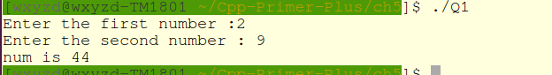

- 练习2：

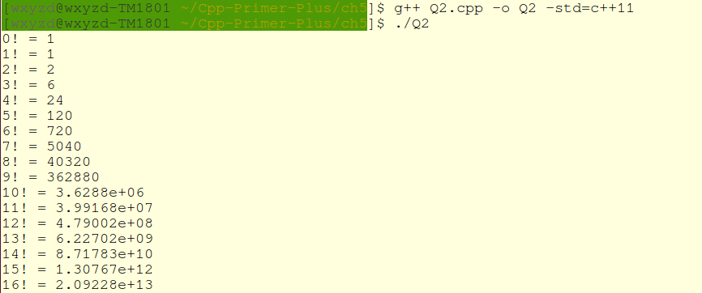


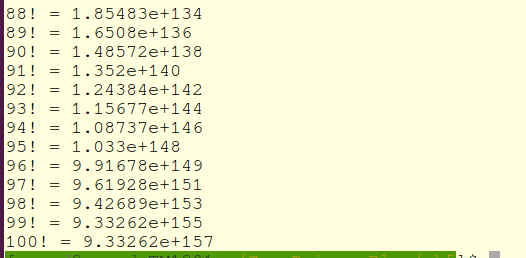

- 练习3：

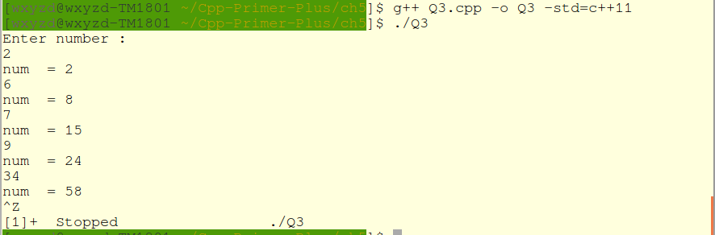

- 练习4：

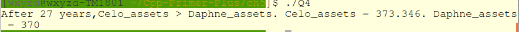

- 练习5：

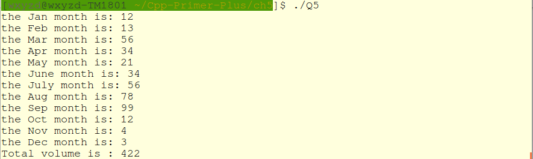

- 练习6：

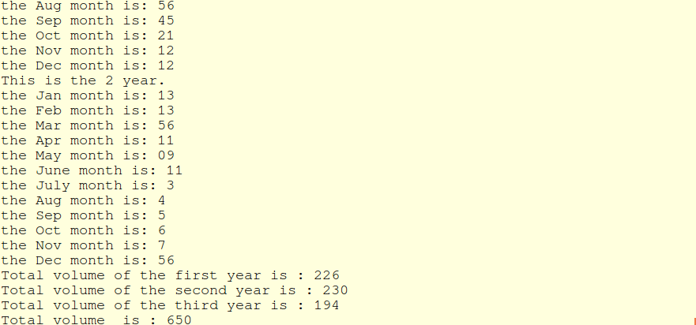

- 练习7：

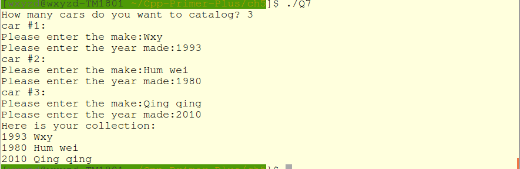

- 练习8：

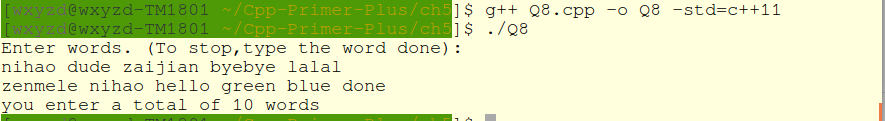

- 练习9：

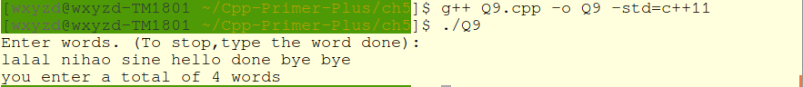

- 练习10：

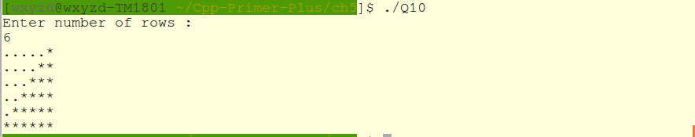

### 小笔记
a++意味着使用a当前的值计算表达式，然后将a加1；++a相反


